# hw0-backend-start

## Настроить SSH подключение к GitHub
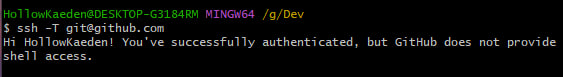

## Создать репозиторий и склонировать его к себе
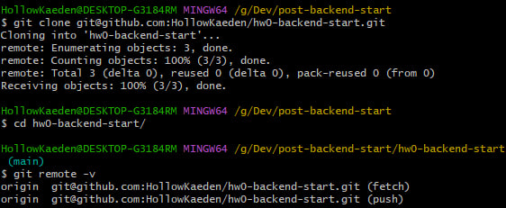

## Создать ветку и сделать несколько коммитов
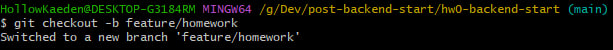
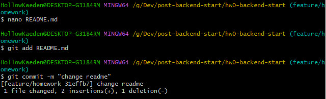

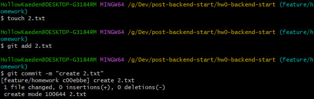
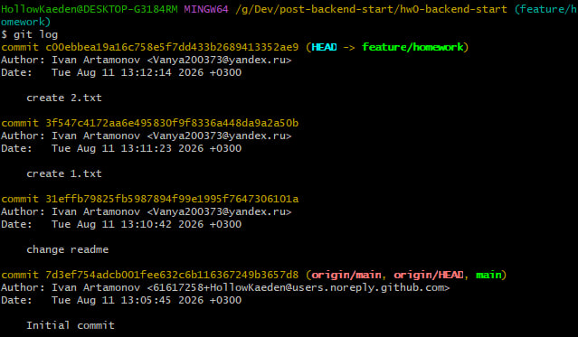

## Привести историю коммитов в порядок через интерактивный rebase
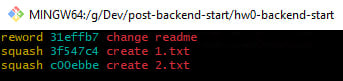
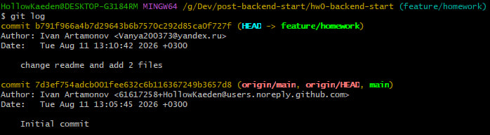

## Отправить ветку и открыть Pull Request
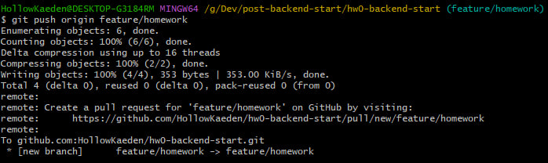
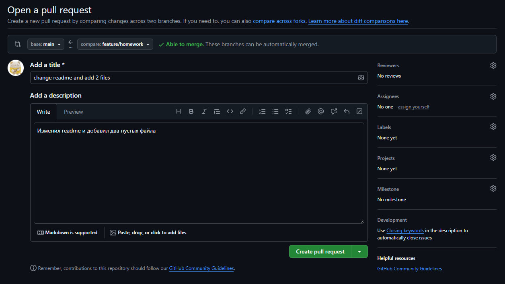
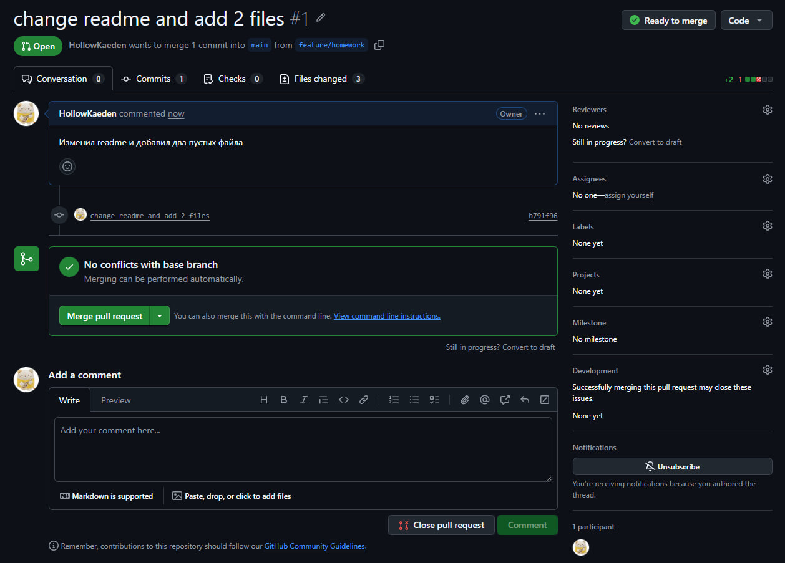
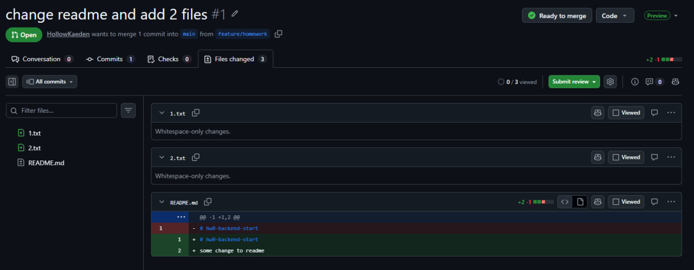

## Дополнительное задание
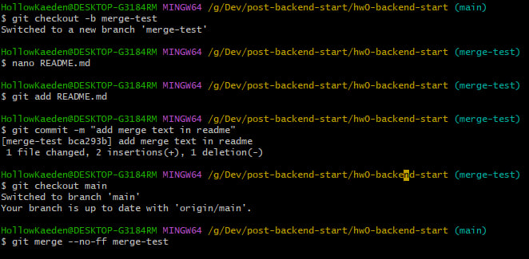
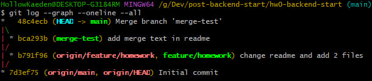
